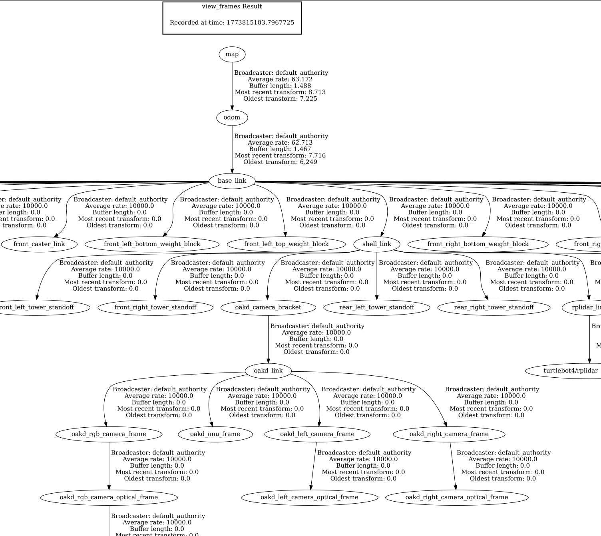

# Tutorial 4: Help & Info

#### Development of Intelligent Systems, 2026

This week you should be working on Task1. Here are some technical details to help you with the implementation.

## Coordinate Transforms

Establishing the relative positions of the many components of a robot system is one of the most important tasks to ensure reliable positioning. Each of the components, such as map, robot, wheels, and different sensors has its own coordinate system and their relationships must be tracked continuously. The static relationships (such as between different static sensors) are relatively simple, consisting of only sequential rigid transformations that need to be computed only once. The dynamic relationships, such as the relative position of the robot to the world coordinates or the positions of the robot arm joints to the camera, however, must be estimated during operation.
You can install the tools for viewing the tf2 transforms as follows:

```bash
sudo apt install ros-jazzy-tf2-tools
```

Then, while your simulation is running, you can run `ros2 run tf2_tools view_frames` to record the tree of the tf2 transformations. This will create a .pdf representation of the tf2 tree that you can analyze.



You can also request the values of the specific transformation between two coordinate frames (example if for transform base_link (robot's position) ->  map) using the command:
```
ros2 run tf2_ros tf2_echo base_link map
```
```
At time 78.636000000
- Translation: [0.011, -0.024, 0.000]
- Rotation: in Quaternion (xyzw) [0.000, 0.000, -0.002, 1.000]
- Rotation: in RPY (radian) [0.000, 0.000, -0.005]
- Rotation: in RPY (degree) [0.000, 0.000, -0.260]
- Matrix:
  1.000  0.005  0.000  0.011
 -0.005  1.000 -0.000 -0.024
 -0.000  0.000  1.000  0.000
  0.000  0.000  0.000  1.000
At time 78.927000000
...
```
This is important for placing the observed objects (faces, rings etc.) into the map, when they will be firstly detected in the coordinate frame of the robot (or, more specifically, in the coordinate frame of the sensor). You can use the scripts included in this tutorial to get you started. You can also work through the [tutorial for the tf2 transforms](https://docs.ros.org/en/jazzy/Tutorials/Intermediate/Tf2/Introduction-To-Tf2.html): 

### Libraries for Transformations
If you do not want to write your own transformations (e.q. Euler angles to Quaternions or vice versa) you can use the following libraries:

```bash
sudo apt install ros-jazzy-tf-transformations ros-jazzy-turtle-tf2-py
pip install transforms3d --user --break-system-packages
```

Then, you can do stuff like:
```python
import tf_transformations
q = tf_transformations.quaternion_from_euler(r, p, y)
r, p, y = tf_transformations.euler_from_quaternion(quaternion)
```

## Nodes

This week's demo nodes deal with mapping points between different coordinate systems. You can use these as the foundation for your own implementation of the tasks.

### map_goals.py

The node `map_goals.py` reads the pre-constructed map from topic `/map` and displays it in a new window. It then waits for user input. When the user clicks on a valid point in the map, the node sends a navigation goal to the robot. This node illustrates some ideas, like how you can read the map from the topic and convert it to a numpy image, how you can convert from pixel coordinates to real world coordinates and more. Build, run, and explore the code.

### transform_point.py

The node `transform_point.py` demonstrates how you can use the TF2 libraries to do transformations between frames. The node sets up the lookup to the coordinate system transformation tree, specifically the transform between frames `map` and `base_link` (the base of the robot). This allows us to define new points in the coordinate system of the robot, and express them in map coordinates. New markers are created at a distance of 0.5m behind the robot and published to the `/breadcrumbs` topic. If we published these without the appropriate transformation, they would always be located behind the robot. However, if we use the correct transformation, the robot will leave a trail of markers behind itself when driving around the map. You will use transformations such as these in your tasks on to place detected objects and faces into the map.

See [the documentation page](https://docs.ros.org/en/jazzy/Tutorials/Intermediate/RViz/Marker-Display-types/Marker-Display-types.html) for the available marker types and more info.

#### Quaternions

By now, you will probably have observed that the robot orientation in ROS2 is represented with 4 values (instead of the more intuitive 3 values). The reason is that the orientation is expressed with quaternions. Quaternions are one of the ways of representing rotation in 3 dimensions. Some of their advantages are conciseness (4 values are the minimum for 3d rotation), no singularities, and simple interpolation (for graphics). However, they are quite complex and unintuitive. One way of imagining quaternion rotation is to think of it as a rotation about an axis represented in 3 dimensions. 

Further reading regarding quaternions can be found in [ROS2 documentation](https://docs.ros.org/en/jazzy/Tutorials/Intermediate/Tf2/Quaternion-Fundamentals.html). You can also check out this [visualizer](https://quaternions.online/).

For easier development and debugging, you might want to transform the poses to a more intuitive representation, such as Euler angles (pitch, roll and yaw are rotations about the x, y, and z axis, respectively). Since we are dealing with a ground robot, the only applicable rotation is around the z axis (the yaw angle). Transform the robot's orientation to Euler angles and display the current orientation using an arrow marker.

You can read more about ROS2 marker types [here](https://docs.ros.org/en/jazzy/Tutorials/Intermediate/RViz/Marker-Display-types/Marker-Display-types.html).

## Saying Hello

As part of Task1, your robot needs to say something when it approaches a detected face. To do this, you can simply record an audio file, and use a module like `playsound` (that you install with `pip install playsound`). There are also other modules for playing sounds: `pydub`, `simpleaudio`, or using the `os` library and playing the sound with your system player.     

A more interesting approach, and one that will also prove useful in the future, is using a text-to-speech (TTS) generator. This is currently a very active research field, and you have many different options for TTS generators. There are simple ones, complex ones, there are those that run on-device, and those that run in the cloud, you can even try to train a deep model for imitating some voice. 

For our purposes, the quality of the generated voice does not matter, so do as you wish. Some modern include (in roughly increasing order of quality and compute required):
- [espeak-ng](https://github.com/gooofy/py-espeak-ng)
- [Piper TTS](https://github.com/OHF-Voice/piper1-gpl)
- [Kitten TTS](https://github.com/KittenML/KittenTTS)
- [Kokoro TTS](https://github.com/nazdridoy/kokoro-tts)
- [Qwen3-TTS](https://github.com/QwenLM/Qwen3-TTS)

## Using ROS bags

Those of you that can only work on the simulation in the lab, make use of the `ros2 bag` command line tool. It is a tool for recording all or some messages published. For example, you can run the simulation and drive to robot around the polygon, while recording the messages published (like the images from the camera). Then you can copy the `bag` file to another computer, replay it there, and work on face detection and clustering. The tutorial for `ros2 bag` is [here](https://docs.ros.org/en/jazzy/Tutorials/Beginner-CLI-Tools/Recording-And-Playing-Back-Data/Recording-And-Playing-Back-Data.html).

## Communication between multiple computers in ROS2

If you want to use multiple computers so they will be able to see each others' ROS2 topics, there are several options, depending on the RMW used. You will have to set `export ROS_LOCALHOST_ONLY=0` and `export ROS_DOMAIN_ID=<id>` (number between 0 and 101) so RMW will only listen on the appropriate [ports](https://docs.ros.org/en/jazzy/Concepts/Intermediate/About-Domain-ID.html).

More in depth information regarding different RMW implementations is available [here](RMW_notes.md).


# Whole process:
## Detect and save face positions (again, improved)
- T1: `ros2 run rmw_zenoh_cpp rmw_zenohd`
- T2: `ros2 launch dis_tutorial4 sim_turtlebot_nav.launch.py map:=/home/erik/rins/maps/maps.yaml` (notice that here we use the newly created folder for maps into which we copied our map files; the program)
- in RViz do '2D Pose Estimate'
- T3: `ros2 run dis_tutorial4 detect_people2.py`
- in RViz Displays menu click 'Add' > 'By topic' and find topic `/people_marker` (`/people_marker_array`) and click on Marker and 'OK' to add it
- when you went through the map, just `Ctrl+C` the T3 to get faces stored in the `/home/erik/rins/src/dis_tutorial4/people_detections.json`

## Setup LLM to make conversations with people
- install LLM locally:
    - `curl -fsSL https://ollama.com/install.sh | sh` (install Ollama)
    - `sudo systemctl enable --now ollama` if first time or `ollama serve` (start the Ollama service, if error, check if already started via `ollama list`)
    - `ollama pull llama3.2:3b` (pull the model our node will use)
    - optionally: `curl http://localhost:11434/api/generate -d '{"model":"llama3.2:3b","prompt":"hello","stream":false}'` (verify HTTP endpoint if we get JSON with response field)
    - `sudo apt install python3-requests` (install Python dependency)
    - `cd /home/erik/rins && colcon build --packages-select dis_tutorial4 && source install/setup.bash` (rebuild and source the workspace)
    - to run the node: `cd /home/erik/rins && source install/setup.bash && ros2 run dis_tutorial4 LLM.py`


## Try out the walk & greet
- commands:
  - T1: `ros2 run rmw_zenoh_cpp rmw_zenohd`
  - T2: `ollama serve` (or check if already running: `ollama list`)
  - T2: `ros2 launch dis_tutorial4 sim_turtlebot_nav.launch.py map:=/home/erik/rins/maps/maps.yaml` and use 2D Pose Estimate
  - T3: `cd /home/erik/rins && source install/setup.bash && ros2 run dis_tutorial4 LLM.py`
  - T4: `cd /home/erik/rins && source install/setup.bash && ros2 run dis_tutorial4 voice_capture --ros-args -p piper_model_path:=/home/erik/piper_models/en_US-lessac-medium/en_US-lessac-medium.onnx`
  - optionally: T5 to make one test request: `cd /home/erik/rins && source install/setup.bash && ros2 service call /human_detected robot_interfaces/srv/HumanDetected "{detect_signal: true}"`
  - T5: `ros2 run dis_tutorial4 detect_people2.py`
  - T6: `ros2 run dis_tutorial4 robot_commander.py`
- TODO: .... or `robot_walk_and_conversation.launch.py`
- how it works: 
  - inside the `robot_commander.py`:
    - in `__init__(...)` we create client for service `human_detected`
    - in `walk_to_persons_and_greet(self, detections_json_path)` we go through the stored face positions in the JSON file, we call `self.trigger_voice_interaction(prefetching=True)` to call LLM to start generating response, and then start navigating towards the person by calling `self.goToPose(face_pose)`, then we wait for robot to reach the goal and at that point we call `prefetch_thread.join()` to join the thread, if the prefetching gave result, we continue, otherwise we call `self.trigger_voice_interaction(prefetching=False)` to trigger the sound interaction again
    - the `trigger_voice_interaction(self, prefetching, timeout_sec=60.0, max_attempts=3)` function makes some attempts at calling service that we initialized client for in `__init__(...)`, this service is called and we just return if node that handles this request finished successfully (played LLM's response as sound) and returned
  - inside the `voice_capture.py`:
    - TODO...
  

## Autonomous search for faces (and rings) on the (already scanned & saved) map

- how it works: inside the `robot_commander.py`:
  - in `__init__(...)` we create tf2_ros Buffer, used in tf2_ros TransformListener, we create publisher for topic `/breadcrumbs`, where we will publish markers to show robot's trajectory, we create timer, in whose callback we: create `PointStamped` in the `/base_link` frame/coord.system, transform it to `/map` coordinates and publish it to `/breadcrumbs`, in `__init__(...)`
  - in `_init_autonomous_search()` we subscribe to the:
    - `/global_costmap/costmap` and
      - inside its callback `_globalCostmapCallback(self, msg: OccupancyGrid)` we simply set the received grid to local variable `self._global_costmap`
      - see the global costmap messages: `ros2 topic echo /global_costmap/costmap --truncate-length 20` (`nav_msgs/msg/OccupancyGrid`), it uses the data from static map that we saved (topic `/map`) and adds some safety buffers (static map only has values 100 for walls, 0 for clear area and -1 for unknown, the costmap also has values from 100 to 0, depending on how close to wall the position is)
        - to not listen to entire global costmap constantly, we can alternatively use the Nav2's updates topic: `/global_costmap/costmap_updates` (`map_msgs/msg/OccupancyGridUpdate`)
    - `/local_costmap/costmap` topics to get the information about map occupancy, to know where near objects are w.r.t. robot
      - inside its callback `_localCostmapCallback(self, msg: OccupancyGrid)` we simply set the received grid to local variable `self._local_costmap`
      - see the local costmap messages: `ros2 topic echo /local_costmap/costmap --truncate-length 20` (`nav_msgs/OccupancyGrid`), which uses LIDAR data (`ros2 topic echo /scan --truncate-length 20` (`sensor_msgs/LaserScan`)) to continuously update the costmap data array
    - `ir_intensity_side_left` to use as drop/cliff sensor
      - inside its callback `_cliffCallback(self, msg: Range)` we store into local variable `self._cliff_detected` if the returned range by the sensor is under some threshold
    (- could additionally use the 3D camera that does PointCloud: `ros2 topic echo /camera/depth/color/points --truncate-length 20` (`sensor_msgs/PointCloud2`))
  - we use **main function** for autonomous search `find_people_and_rings_autonomously(self)`, in which we sweep the robot's perception circle across the global costmap cells that have cost < `GLOBAL_COST_THRESHOLD` by navigating to each candidate viewpoint (skipping those that have cliff or newly placed obstacle):
    0. we call `self._init_autonomous_search()` and wait for costmap messages to arrive after subscribing
    1. sample candidate viewpoints by calling `self._sample_candidate_viewpoints()`
    2. order viewpoints greedily w.r.t. current robot pose by calling `self._order_viewpoints_by_proximity(viewpoints, start_x, start_y)`
    - for each viewpoint:

      3. check for cliff (`self._is_cliff_safe()`) and local obstacle (`self._is_local_costmap_clear(wx, wy)`)

      4. navigate to the viewpoint using `self.goToPose(goal)`, rechecking the safety from 3. while navigating

      5. if navigation to viewpoint succeeded we can optionally add 360deg spin to scan whole surroundings there and we can read perception results for face/ring detection along the way

  - the **helpers**:
    - `_sample_candidate_viewpoints(self) -> list[tuple[float, float]]` creates candidate goals for search trajectory: enumerates all world coordinates in which if robot was positioned there, its perception circle (with radius `PERCEPTION_RADIUS_M` from base_link origin) would cover at least one global costmap position with cost > `GLOBAL_COST_THRESHOLD`; we sample candidate coordinates with step of `VIEWPOINT_GRID_STEP_M`, so that trajectory is not too rigid; 
    - `_order_viewpoints_by_proximity(self, viewpoints: list[tuple[float, float]], start_x: float, start_y: float) -> list[tuple[float, float]]` orders the points on lookout trajectory by sorting the remaining candidates so that nearest candidate is chosen as next goal point (essentially we cluster nearby candidates so that we don't generate too many redundant goals and keep search trajectory simple)
    - `_is_local_costmap_clear(self, goal_wx: float, goal_wy: float) -> bool` checks if the local costmap shows any unexpected obstacles near the goal (if cell cost was low in global costmap but is costly in local one (newly placed object)), it checks small window around the goal in local costmap, if cost is high, we check if it is low in global costmap, if so, we skip the goal because new object was places in the way
    - `_costmap_to_numpy(self, costmap: OccupancyGrid) -> np.ndarray` uses the costmap (flat OccupancyGrid array, starting at left down world coordinate) and returns it in 2D integer array
    - `_world_to_cell(self, costmap: OccupancyGrid, wx: float, wy: float) -> tuple[int, int]` uses costmap and some world coordinates and converts them to cells in which they lie inside OccupancyGrid
    - `_cell_to_world(self, costmap: OccupancyGrid, row: int, col: int) -> tuple[float, float]` uses costmap and cell coordinates (inside the occupancy grid) to get back the world coordinates
